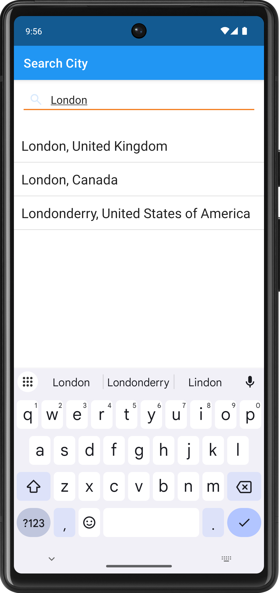
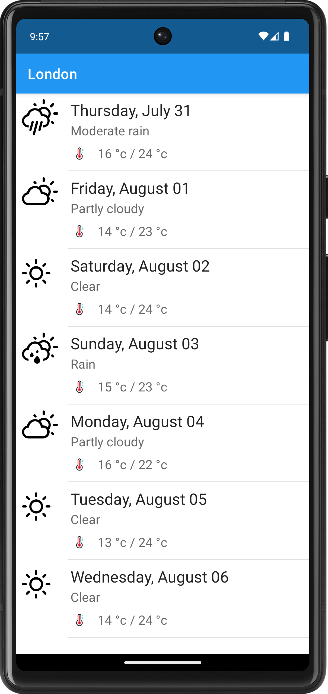

<div align="center">
  
</div>

## Android Weather App

This is a simple Android weather application that fetches weather data from the [WeatherAPI](https://www.weatherapi.com/). It provides current hour data, an hourly weather forecast, a seven-day weather forecast, and a city search feature. On the first use of the app, an alert dialog prompts the user to choose a city. The selected city is saved in SharedPreferences and used as the default weather location for subsequent sessions.

### Content
1. [ScreenShots](#screenshots)
2. [Features](#features)
3. [Technologies Used](#technologies-used)
4. [Setup Instruction](#setup-instructions)
5. [Learning Outcomes](#learning-outcomes)
6. [Change Log](#change-log)
7. [Future Enhancement](#future-enhancements)
8. [About Developer](#about-developer)

### ScreenShots

* **Working Demo:** A quick demonstration of the app's key features, including city search and forecast views. [YouTube](https://youtube.com/shorts/W2iOgoGZ9Jo?si=hvuwlaMYJFPPoDGS)

* **Different Screen:**
<div align="center">
    <table style="width:100%;border:none">
        <td align="center">
            
            <br>
            <i>Open Screen</i>
        </td>
        <td align="center">
            
            <br>
            <i>City Search</i>
        </td>
        <td align="center">
            
            <br>
            <i>Home Screen</i>
        </td>
        <td align="center">
            
            <br>
            <i>Weather Forecast</i>
        </td>
        <td align="center">
            
            <br>
            <i>Saved Cities</i>
        </td>
    </table>
</div>

### Features

* **Comprehensive Weather Reporting:** Get a detailed and up-to-date weather report for the current location, including essential metrics like temperature, humidity, wind speed, and weather conditions.
* **Hourly and Weekly Forecasts:** Plan your day and week with an hourly forecast for the next 24 hours and a 7-day outlook, providing you with a clear picture of upcoming weather patterns.
* **Location Management:**
    * **Find and Set Locations:** Easily search for a new city and set it as your primary weather location.
    * **Saved Cities:** Conveniently switch between your saved favorite cities without having to search again.
* **Offline-First Data Access:** Thanks to local caching, the application can display previously fetched weather data even without an active internet connection, ensuring a seamless user experience.

### Technologies Used

* **Language:**
    * [Kotlin](https://kotlinlang.org/): The primary language for building the application.
* **Android Framework:**
    * [Android SDK](https://developer.android.com/): Core Android platform libraries.
    * [Android Jetpack](https://developer.android.com/jetpack): A suite of libraries to help with best practices, including:
        * [ViewModel](https://developer.android.com/topic/libraries/architecture/viewmodel): To store and manage UI-related data in a lifecycle-conscious way.
        * [Room](https://developer.android.com/training/data-storage/room): For local data caching and creating an offline-first experience.
        * [Lifecycle](https://developer.android.com/jetpack/androidx/releases/lifecycle): To manage the lifecycle of your app components.
* **Networking:**
    * [Retrofit2](https://square.github.io/retrofit/): A type-safe HTTP client for Android and Java.
    * [OkHttp](https://square.github.io/okhttp/): The underlying HTTP client used by Retrofit, with an `Interceptor` for dynamic request manipulation.
    * [Gson](https://github.com/google/gson): A library to convert JSON to Java objects and vice-versa.
* **Dependency Injection:**
    * [Koin](https://insert-koin.io/): A pragmatic dependency injection framework.
* **UI/UX:**
    * [Shimmer](https://github.com/rahulstech/shimmer-android): A loading animation library for a better user experience.
    * `RecyclerView`: For efficient display of large data sets (e.g., city lists, forecasts).
* **Development Tools:**
    * [Android Studio](https://developer.android.com/studio): The official IDE for Android development.
    * [Gradle](https://gradle.org/): The build automation system.

### Setup Instructions

To get this project up and running:

1.  **Clone the Repository:**
    ```bash
    git clone [https://github.com/rahulstech/android-weather-app.git](https://github.com/rahulstech/android-weather-app.git)
    cd android-weather-app
    ```
    
2.  **Open in Android Studio:**
    * Open the cloned project in Android Studio.
    * **Important Note on Compatibility:** Android Gradle Plugin (AGP) versions are often tied to specific Android Studio versions. This project was developed and tested with:
        * **Android Studio Version:** Android Studio Meerkat Feature Drop | 2024.3.2 Patch 1
        * **Android Gradle Plugin (AGP) Version:** 8.7.3
        * **Gradle Version:** 8.9
        * **Target/Compile SDK:** 36
        * **Min SDK:** 26

    * If you encounter build errors related to Gradle sync or incompatible plugin versions, try using the recommended Android Studio version or allow Android Studio to suggest an upgrade path for AGP and Gradle. Be aware that upgrading AGP might require updating `targetSdk`, `compileSdk`, and some library dependencies.

3.  **Configure API Key:**
    * Create a file named `local.properties` in the project root directory (same level as `settings.gradle`).
         **Note:** DON'T FORGET TO ADD `local.properties` IN `.gitignore` BEFORE PUSHING TO VERSION CONTROL
    * Add your WeatherAPI key to this file:
        ```properties
        WEATHER_API_KEY=YOUR_API_KEY_HERE
        ```
      * Replace `YOUR_API_KEY_HERE` with your actual key obtained from [WeatherAPI](https://weatherapi.com/).
      * Open the **backend/weather-repository** module and add the following lines in the module level `build.gradle`
          ```groovy
             android {
    
                   // other configurations here
    
                   def localProperties = new Property()
                   def localPropertiesFile = rootProject.file('local.properties')
                   if (localPropertiesFile.exists()) {
                         localPropertiesFile.withReader('UTF-8') {
                             localProperties.load(it)
                         }
                     }
        
                 buildFeature {
                     buildConfig = true // must add otherwise show warning
                 }
        
                 buildConfigField( // adds new field to the module level BuildConfig.java
                      "String", // field type
                      "WEATHER_KEY_API", // field name
                      "\"${localProperties.getPerperty('WEATHER_API_KEY')}\"" // field value, for string must add double quote
                 )
             }
           ```

4.  **Build and Run:**
    * Sync the project with Gradle files.
    * Run the application on an emulator or physical device.

### Learning Outcomes

This project was a significant learning experience, allowing me to apply and solidify my understanding of modern Android development principles. Key takeaways and skills demonstrated include:

#### API Integration & Data Handling

* **API Calls with Retrofit2 & Converters:** I learned to integrate and configure the Retrofit2 library for making API calls. A key part of this was using a Gson converter for seamless serialization and deserialization of request bodies to JSON and responses from JSON into Kotlin/Java objects, which is a standard practice for interacting with REST APIs.
* **Dynamic Request Manipulation with OkHttpClient Interceptor:** I implemented an `OkHttpClient Interceptor` to handle a common and crucial task: appending the API key as a query parameter to every network request. This demonstrates a professional approach to managing request headers or parameters dynamically without having to add them to each individual call.
* **URL & Path Configuration:** Through practical application, I solidified my understanding of how Retrofit constructs URLs, specifically the importance of the base URL ending with a `/` and how relative paths in service methods (e.g., `@GET("current.json")` vs. `@GET("/current.json")`) affect the final request URL.

#### App Architecture & Data Layer Design

* **Offline-First Data Layer Design:** The app was designed following Android's data layer guidelines to handle multiple data sources. This involved using **Room** for local data caching and the **WeatherAPI** as the remote data source. This architecture ensures data integrity and provides a robust offline-first experience, reducing dependency on network connectivity and minimizing API calls.
* **Dependency Injection with Koin:** I implemented the **Koin** library for dependency injection. This was crucial for managing the app's components (like the API service and database instances), making the codebase more modular, testable, and easier to maintain.

#### UI & User Interaction

* **Handling `RecyclerView` Item Clicks:** I learned to create a custom solution for handling `RecyclerView` item clicks using `RecyclerView.OnItemTouchListener` in combination with a `GestureDetector`. This provided a flexible way to detect and handle different user gestures, such as single taps and long presses, on list items.

### Change Log

* **v3.0 - Offline-First & Data Layer Enhancement**
    * Implemented a local data cache using the **Room Persistence Library**.
    * The application now follows an offline-first architecture, significantly reducing API calls and allowing users to view cached data without an active internet connection.

* **v2.0 - Core Feature Expansion**
    * Expanded the application's functionality with four major features:
        1.  **City Search & Management:** Users can now search for cities via the API and change the current weather location.
        2.  **Detailed Current Weather Report:** A comprehensive report for the current hour, including essential details like UV index, precipitation, and sunrise/sunset times.
        3.  **Hourly Weather Forecast:** A detailed 24-hour forecast for the selected location.
        4.  **3-Day Weather Forecast:** A forecast for the next three days, providing an overview of expected weather conditions.

* **v1.0 - Initial Release**
    * A simple proof-of-concept version focused on API integration.
    * Successfully made a basic API call to the WeatherAPI for a fixed location (**London**).
    * Implemented basic success/failure handling, logging API errors to the console and displaying a `Toast` message for general exceptions.

### Future Enhancements

- [ ] **Robust Error Handling:** Implement UI to gracefully handle and display error states. This will include specific messages for network failures, API errors (e.g., "City not found," "API key invalid"), and database errors, providing a more professional and user-friendly experience.
- [ ] **Dark Theme:** Add support for a dark theme, allowing users to switch between a light and dark color scheme for improved readability and comfort in low-light environments.

### About Developer

I am Rahul Bagchi, a passionate Android developer with a focus on building robust, scalable applications. My expertise lies in architecting data-driven apps and leveraging modern frameworks like Retrofit2, Room, and Koin to create high-quality user experiences.

<div>
    <b>Connect with me: </b>
    &nbsp;&nbsp;&nbsp;&nbsp;
    <a href="https://www.linkedin.com/in/rahul-bagchi-176a63212/" target="_blank">
      
    </a>
    &nbsp;&nbsp;&nbsp;&nbsp;
    <a href="https://github.com/rahulstech/" target="_blank">
      
    </a>
</div>